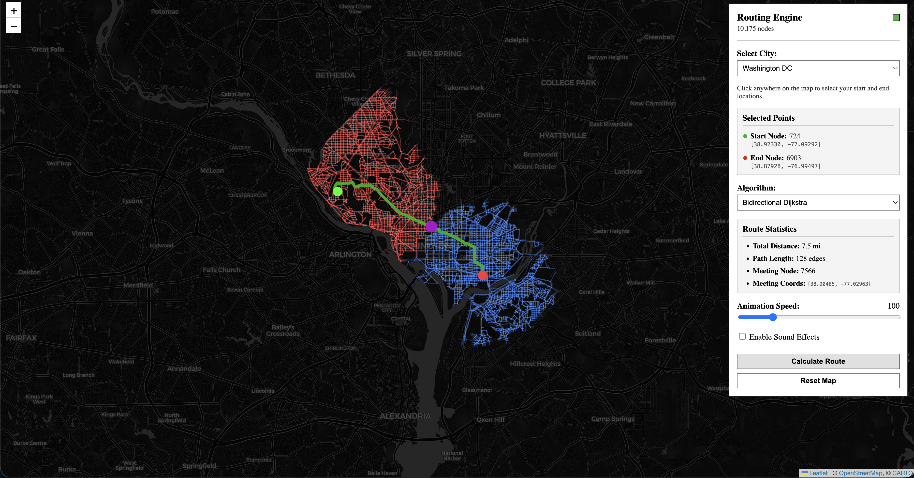

# Routing Engine

A C++ pathfinding engine that computes the shortest route between two real-world locations using **Dijkstra**, **Bidirectional Dijkstra**, **A\***, and **Bidirectional A\*** search over real road network graphs extracted from OpenStreetMap. The engine is compiled to **WebAssembly** and deployed as a fully client-side, interactive demo via **GitHub Pages**, with graph data pipelines written in Python and a CI/CD pipeline powered by **GitHub Actions**.

<p align="center">
  
</p>

<p align="center">
  <a href="https://adsrx222.github.io/routing-engine/">
    
  </a>
</p>

## Overview

This project implements an basic C++ pathfinding logic core with classical (Dijktra's Algorithm) and heuristic-guided graph search algorithms (A*). It is compiled to web assembly and used in an interactive web UI. Users pick two points on a map of a real city, and the engine computes the shortest path between them, visualizing the search as it happens.

The system is split into three separate layers:

1. **Graph acquisition** — a Python pipeline that pulls real OpenStreetMap road network data and serializes it into a compact binary graph format.
2. **Routing core** — a C++ engine implementing four search algorithms over that graph, compiled to both a native binary (for testing/benchmarking locally) and WebAssembly (for the browser).
3. **Web frontend** — a lightweight HTML/CSS/JS interface that loads the WASM module, renders the map, and lets users interactively trigger searches.

---

## How It Was Built

### 1. Graph data — OpenStreetMap → binary graph

`scripts/download_graphs.py` queries OpenStreetMap (via the Overpass API) for a given city's drivable road network, then:

- Parses raw OSM nodes and ways into a directed graph representation (intersections as nodes, road segments as weighted edges).
- Computes edge weights from real segment geometry (haversine distance), so search costs correspond to actual road distances.
- Prunes unreachable/disconnected components to keep the graph well-formed for search.
- Serializes the result into a compact `.bin` format (see `web/graphs/`) that the C++ loader can read directly, avoiding any JSON/XML parsing overhead at runtime.

Graphs are pre-generated for several cities (`dc_graph.bin`, `ny_graph.bin`, `seattle_graph.bin`, `sf_graph.bin`) plus a small `mock_graph.bin` used for fast local testing.

### 2. Routing core — C++

The core lives in `src/`:

- **`graph/`** — `Graph` and `GraphLoader` handle the in-memory adjacency representation and deserialization of the binary graph format produced by the Python pipeline.
- **`algorithms/`** — a common `Algorithm` interface (`algorithm.h`) is implemented by four search strategies:
  - `dijkstra.cpp` — classic uniform-cost search, no heuristic.
  - `astar.cpp` — Dijkstra guided by a haversine-distance heuristic to the goal, expanding fewer nodes.
  - `double_dijkstra.cpp` — bidirectional Dijkstra, searching simultaneously from source and target and meeting in the middle.
  - `double_astar.cpp` — bidirectional A\*, combining both optimizations for the fastest practical searches.
  
  Each run produces a `SearchResult` (final path, cost, nodes expanded) and a stream of `SearchEvent`s used to animate the search frontier on the frontend.
- **`router/`** — `Router` ties graph loading and algorithm selection together behind a single entry point, exposing a consistent API regardless of which algorithm is chosen.
- **`wasm_bindings.cpp`** — Embind bindings exposing the `Router` and algorithm selection to JavaScript, so the browser can call directly into the compiled C++ core.

### 3. Compiling to WebAssembly

`scripts/build_wasm.sh` drives an Emscripten build via CMake, compiling the routing core (graph loader + all four algorithms) into `web/dist/pathfinder.wasm` alongside its JS glue code (`pathfinder.js`). The same C++ source compiles natively too, via the top-level `CMakeLists.txt`, so the algorithms can be unit tested (`tests/`) with a normal C++ toolchain independent of the browser build.

### 4. Frontend

`web/index.html`, `web/app.js`, and `web/style.css` form a minimal, dependency-light UI:

- Loads the compiled WASM module and a selected city's graph.
- Renders the road network and lets the user click two points (or search locations) to set source/destination.
- Lets the user pick which algorithm to run (Dijkstra / Bidirectional Dijkstra / A\* / Bidirectional A\*).
- Visualizes the expanding search frontier in real time using the `SearchEvent` stream, then draws the final shortest path.

### 5. CI/CD — GitHub Actions → GitHub Pages

On every push to the main branch, a GitHub Actions workflow:

1. Sets up the Emscripten toolchain.
2. Builds the WASM module and JS bindings via `scripts/build_wasm.sh`.
3. Assembles the static `web/` directory (HTML, CSS, JS, compiled WASM, and pre-generated graph binaries).
4. Deploys the resulting static site to **GitHub Pages**.

---

## Project Structure

```
├── CMakeLists.txt              # Native + WASM build configuration
├── scripts/
│   ├── build_wasm.sh           # Emscripten build script
│   ├── download_graphs.py      # OSM → binary graph pipeline
│   ├── requirements.txt        # Python dependencies
│   └── run_server.sh           # Local dev server for web/
├── src/
│   ├── algorithms/
│   │   ├── algorithm.h         # Common search algorithm interface
│   │   ├── dijkstra.cpp/.h
│   │   ├── astar.cpp/.h
│   │   ├── double_dijkstra.cpp/.h   # Bidirectional Dijkstra
│   │   ├── double_astar.cpp/.h      # Bidirectional A*
│   │   ├── search_event.h      # Frontier expansion events (for visualization)
│   │   └── search_result.h     # Path + cost + stats output
│   ├── graph/
│   │   ├── graph.cpp/.h        # In-memory graph representation
│   │   └── graph_loader.cpp/.h # Binary graph deserialization
│   ├── router/
│   │   └── router.cpp/.h       # High-level routing API
│   └── wasm_bindings.cpp       # Embind bindings for the browser
├── tests/
│   ├── algorithms/
│   │   └── test_dijkstra.cpp
│   ├── graph/
│   └── router/
└── web/
    ├── index.html
    ├── app.js
    ├── style.css
    ├── dist/
    │   ├── pathfinder.js       # Emscripten glue code
    │   └── pathfinder.wasm     # Compiled routing core
    └── graphs/
        ├── dc_graph.bin
        ├── ny_graph.bin
        ├── seattle_graph.bin
        ├── sf_graph.bin
        └── mock_graph.bin
```